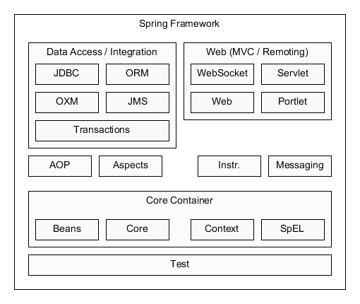

= Spring
:toc:
:toclevels: 5

{empty} +

==== Architecture

* Core
** Core
** Bean
** Context
** SpeL : expression language for manipulating object graph at runtime
* Data Access/Integration
** JDBC :
** ORM : integrates object-relational-mapping (JPA/JDO/Hibernate)
** OXM : supports object-xml-mapping (JAXB, Castor, XMLBeans)
** JMS :
** Transactions :
* Web
* Miscellaneous

{empty} +

==== JpaRepository
* is-a Repository with JPA
* is-a Component with DAO

{empty} +

==== Hypertext Application Language (HAL)
HAL is a simple format that gives a consistent and easy way to hyperlink between resources in your API.

Adopting HAL will make your API explorable, and its documentation easily discoverable from within the API itself.
In short, it will make your API easier to work with and therefore more attractive to client developers.

APIs that adopt HAL can be easily served and consumed using open source libraries available for most major programming languages.
It's also simple enough that you can just deal with it as you would any other JSON.

http://stateless.co/hal_specification.html

{empty} +

==== CORS : cross-origin resource sharing
s a mechanism that allows restricted resources on a web page
to be requested from another domain outside the domain from which the first resource was served

{empty} +

==== Context -> Spring Bean
* ApplicationContext is an interface
* Some ApplicationContextImpl is used to provide _context_.
* context provides Spring Beans

{empty} +

=== Frontend

[cols="1,2"]
|===
| Spring MVC | Servlet based
| Spring WebFlux | reactive
|===

{empty} +

=== Templates

* 🌱 provides templates to hide boilerplate:
** `JdbcTemplate`
** `JmsTemplate`
** `RestTemplate`
** `WebServiceTemplate`
