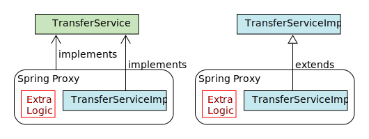

= Proxy
:toc:
:toclevels: 5

=== Proxy

* used to:
** intercept calls to bean to inject AOP advice
* JDK proxy
** part of JDK (aka. dynamic proxy)
** requires `iface` (`iface` based)
* `CGLib` Proxy
** used by spring via `CGLib` lib
** included in spring-core (since 3.2)
** subclass based (proxied class must not be final / have final methods)
* neither proxy intercepts self-invocations
** `obj.foo(){ obj.bar(); }`
* multiple layers of proxies may be used, beware complexity.

{empty} +

=== Proxy Selection

* if no iface exists or CGLib forced (`@EnableAspectJAutoProxy(proxyTargetClass = true)`),
- then `CGLib` is used,
- else JDK proxy is used.
