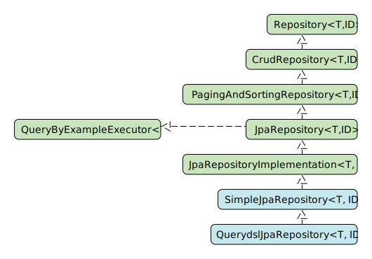

= Spring Boot JPA
:toc:

{empty} +

=== Spring Data Repo

* syntax: +
`find(First[count])By[property expression][comparison operator][ordering operator]`
* creates proxy, routes calls to default `SimpleJpaRepository`
* `@Query` allows specifying a query in `JPQL` (Java Persistence Query Language) and native `SQL`.

{empty} +

=== Repo Hierarchy

