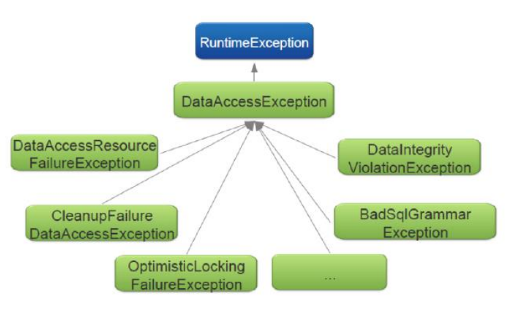

= Spring JPA
:toc:
:toclevels: 5

=== About

* see `about-java/persistence/JPA`

=== Demo Layers

* starting with `ds` we can make `db` queries.
* each layer adds features, until we arrive at `em`

image:img/spring-jpa-layers.svg[,90%]

{empty} +

=== DataSource

* `DriverManagerDataSource` : new connection for every request
* `SimpleDriverDataSource` : like `DriverManagerDataSource` but works with JDBC directly.
* `SingleConnectionDataSource` : same connection for every request, but is not a pooled data source.
* `EmbeddedDatabase` via `new EmbeddedDatabaseBuilder().build()`
** mostly for _dev_ and _test_.

{empty} +

=== JdbcTemplate

* performs iteration over `ResultSet`, extracts values.
* translates/rethrown JDBC-E to `DataAccessException`
* uses callbacks:
** `RowMapper` (see demo)
** `RowCallbackHandler` (TODO)
** `ResultSetExtractor`
* methods
** *update* / batchUpdate
- to use with DML (INSERT / UPDATE /DELETE)
- returns number of rows affected (`int` / `int[]`)
** *execute*
- can be used with any instruction
- usually used with DDL (CREATE / ALTER / DROP / TRUNCATE / COMMENT)
- returns `void`
** *query* / queryForList / queryForMap / queryForObject / queryForRowSet
- returns `T` or `List<T>`
* new conn for every method called (avoids hogging)

{empty} +

=== Transactions
* _local_ on a single resource (db, msg que)
* _global_ over multiple resources
** e.g. if resource B fails to persist, resource A rolls back as well
** requires custom transaction manager

===== TX Trivia

* method with `@Transactional` must be `public`
* must `@EnableAspectJAutoProxy` unless you want to specify `ifaces`.
* calling `@Transactional` of same obj, bypasses proxy
** thus, the called method will execute within the same TX ctx
* recommend to put `@Transactional` on concrete classes/methods as this will work with both proxy types.
* must wrap `ds` in `TransactionAwareDataSourceProxy` to use `@Transactional`
* 🌱 tx use `TransactionInterceptor` for aop

===== TX Isolation Levels

* relative to other TX
* issues
** DR (dirty read):
*** TX2 updates cache -> TX1 reads uncommitted data from cache
** NRR (non-repeatable read):
*** TX1 reads row -> TX2 *updates* row -> TX1 reads row with diff *values*.
** PR (phantom read):
*** TX1 reads table -> TX2 *inserts/deletes* row -> TX reads table with diff *rows*.

[cols="4,1,1,1,1,1,1"]
|===
| Level | DR | NRR | PR | read 🔒 | write 🔒 | range 🔒

| 8 Serializable        |   |   |   | ✔️ | ✔️ |  ✔️
| 4 Repeatable Read     |   |   | ✔️ | ✔️ | ✔️ |
| 2 Read Committed      |   | ✔️ | ✔️ |   | ✔️ |
| 1 Read Uncommitted    | ✔️ | ✔️ | ✔️ |   |   |
| -1 Default            |   |   |   |   |   |
|===

===== TX Propagation

[cols="1,4"]
|===
| mandatory | There must be an existing TX when the method is invoked, or an E will be thrown
| nested | Executes in a nested transaction if a transaction exists, otherwise a new
transaction will be created. This transaction propagation mode is not implemented in
all transaction managers
| never | Method is executed outside of a transaction. Throws exception if a transaction
exist
| not_supported | Method is executed outside of a transaction. Suspends any
existing transaction
| required (default) |  Method will be executed in the current transaction. If no
transaction exists, one will be created
| requires_new |  Creates a new transaction in which the method will be executed.
Suspends any existing transactio
| supports | Method will be executed in the current transaction, if one exists, or outside
of a transaction if one does not exist
|===

===== JDBC AutoCommit

* commits after every query
* makes it to have multiple queries (unit of work) within a TX
* `setAuttoCommit(false)` to disable

===== Rollbck Policy

* default : on `uEx` / `rErr`
* `@Transactional(rollbackFor="", noRollbackFor="")`

{empty} +

=== JPA

===== Glossary

[cols="1,8"]
|===
| `ds` | `DataSource`
| `pc` | `PersistenceContext` ~ cache
| `em` | `EntityManager` ~ API for managing `pc` / interacting with entities.
| `emf` | `EntityManagerFactory` ~ creates `em`
| `tm` | `TransactionManager`
|===

===== ORM

* think Hibernate
* ✔️
** decent abstraction, less boilerplate, unified API
** cache
* ⛔
** slow, added hidden complexity

===== Cache

* cache : copy of data outside of the db
* flushing : writing cache back to db
* `PersistenceContext` ~ cache
** has it's own non-shared db conn

{empty} +

===== JPA

* starts at `emf` (`ds` and `jdbc` themselves are not yet considered `jpa`)
* to use, define:
** `emf`
** jpaVendor
*** EclipseLinkJpaVendorAdapter
*** HibernateJpaVendorAdapter
*** OpenJpaVendorAdapter

===== EMF

* ~ `PersistenceUnit`
* provided as either:
** app-managed : `LocalEntityManagerFactoryBean`
** container-managed : `LocalContainerEntityManagerFactoryBean`
* injected as : `EntityManagerFactory`

===== @Entity

* scanned at r-time & included in persistence unit.
* need also to define a JPA vendor

===== JTA

* `tm` are global : may span multiple resources (dbs, ques)
* if using 1 `emf`, then `JpaTransactionManager` recommended
** only `tm` that is `emf` aware
* if > 1 `emf`, then use JTA `tm`

{empty} +

=== Exceptions

* Spring favors `uEx` for simplicity.
* all of the below `E` are `uEx` :

{empty} +

=== Trivia

* if non-Boot : must set up `em`
* `@PersistenceConext` is not an injection, but a proxy
** returns em of current tx, or creates new em.
* tx can be declared _readOnly_ - this can improve performance
