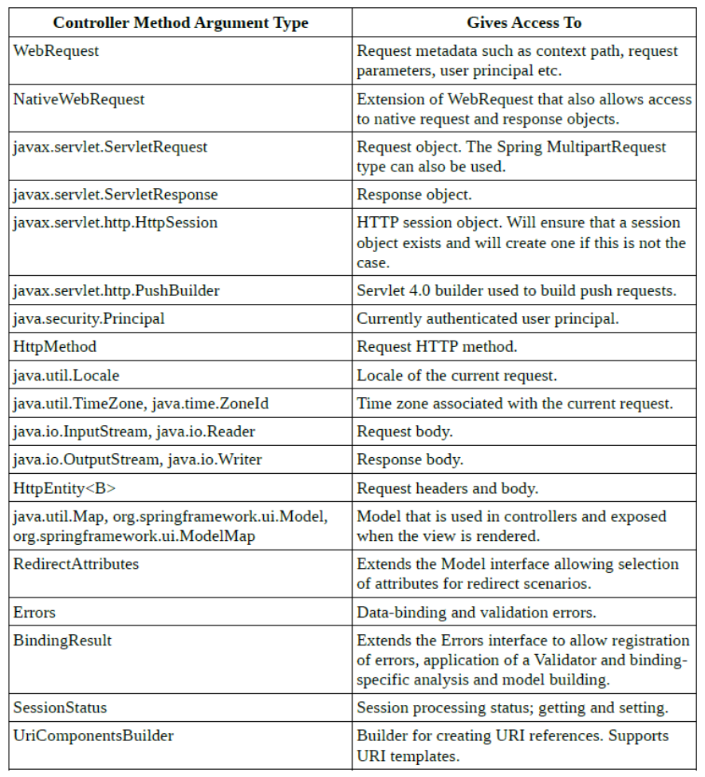
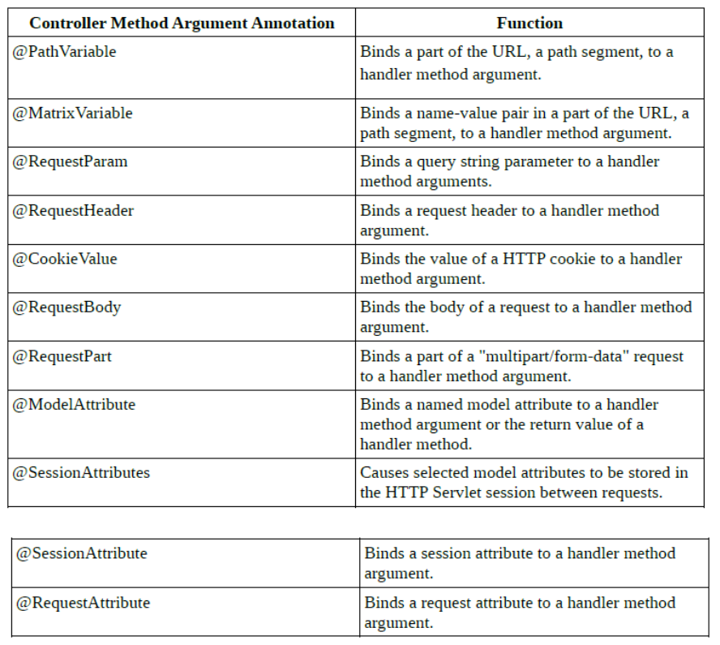
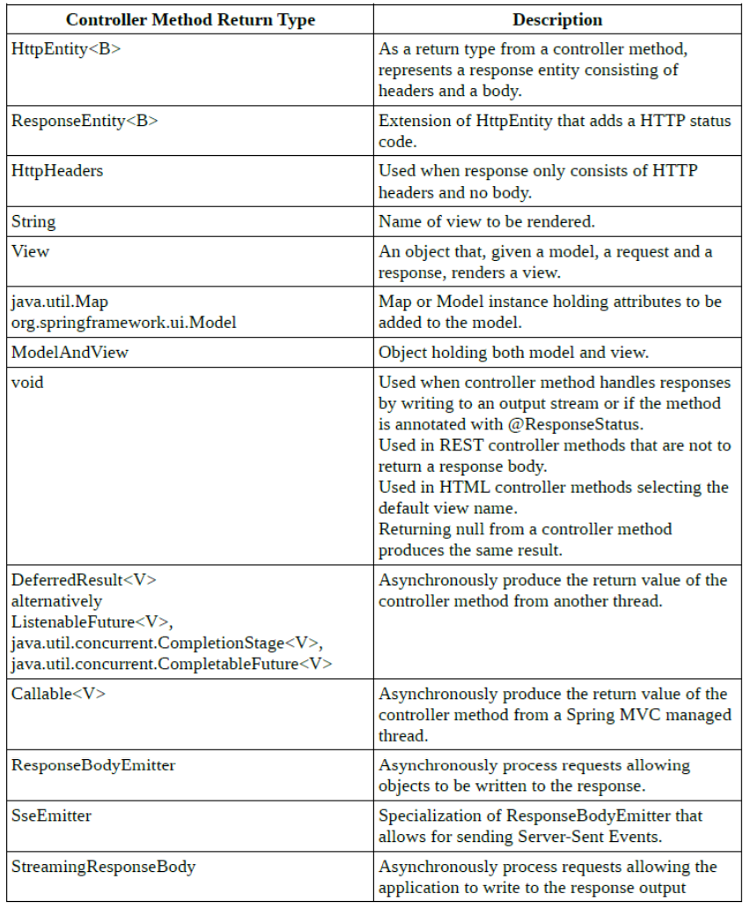
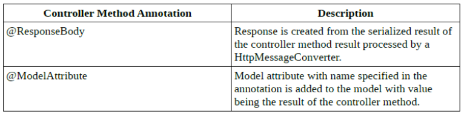

= Spring MVC
:toc:
:toclevels: 5

=== Overview

[cols="1,8"]
|===
| (2) | Handler mapping decides the particular controller by using the URL and request parameters.
| (3) | Response data is wrapped in _model_. _view name_ is also returned.
| (4) | disp-servlet contains ☕ which impl `ViewResolver`. +
Asks those to resolve _view name_ until success.
|===

===== Dispatcher Servlet

* front controller pattern
* central dispatcher servlet
** processes requests, delegates to delegates (`@Controller`)
** resolves views, maps view-names to view instances
** resolves `Ex`
* enables centralized handling of security/`Ex`
* web app, may define >1 dispatcher servlets,
** each with own namespace / app context / set of mappings/handlers
* disp-servlet is init before any app-ctx

===== Handler Mapping

skip

===== Controller
* handler methods can return
- `Model`
- `ModelAndView`
- `String` (usually view name)
- `JstlView` (JSP Standard Tag Library)

* for more, see EOF.

===== Model

* impl `Model`
* collection of key-value pairs
* represents state of the app
* is provided as param to the `View`

===== View Resolver

* In Boot `WebMvcAutoConfiguration` automatically configures the following bean in the application context:
** `InternalResourceViewResolver`
** `BeanNameViewResolver`
* `ThymeleafViewResolver` also exists

===== View

* impl `View`

[source]
public interface View {
    void render(
        @Nullable Map<String, ?> model,
        HttpServletRequest request,
        HttpServletResponse response
    ) throws Exception;
}

* View Types: JSP, Velocity, FreeMarker, JSF, Tiles, Thymeleaf, ...

===== ModelAndView

* Obj that combines `Model` and `View` (as in view name to be returned from handler method.

{empty} +

=== Trivia

* `spring-core` does not include `spring-mvc.jar`
** `spring-mvc` includes `spring-core`

===== Web Container

* servlet 3.0:
** container uses impl of `ServletContainerInitializer` to config servlet container
* spring:
** `SpringServletContainerInitializer` implements `ServletContainerInitializer`
** `SpringServletContainerInitializer` calls `WebApplicationInitializer`
* spring 3.2:
** `WebApplicationInitializer` extends `AbstractAnnotationConfigDispatcherServletInitializer`
** `AbstractAnnotationConfigDispatcherServletInitializer` creates
*** `DispatcherServlet`
*** `ContextLoaderListener`
* 2 ways to init disp-servlet:
** xml
** extend `AbstractAnnotationConfigDispatcherServletInitializer`

===== Controller param types

* if not in below list
** if simple -> as if @RequestParam
** if complex -> as if @ModelAttribute

===== Param Annotations

===== Method Anno

==== Test

he goal of Spring MVC Test is to provide an effective way to test controllers by performing requests and generating responses through the actual DispatcherServlet.
Spring MVC Test builds on the familiar “mock” implementations of the Servlet API available in the spring-test module.
This allows performing requests and generating responses without the need for running in a Servlet container However, when writing such a unit test, much remains untested: for example, request mappings, data binding, type conversion, validation, and much more.
Furthermore, other controller methods such as @InitBinder, @ModelAttribute, and @ExceptionHandler may also be invoked as part of the request processing lifecycl

= REST
* public interface HttpMessageConverter<T> converts HTTP requests to/from obj
* spring provides:

BufferedImageHttpMessageConverter: Converts BufferedImage to and from image binary data; - Jaxb2RootElementHttpMessageConverter: Reads and writes XML (either text/xml or application/xml) to and from JAXB2-annotated objects.
Registered if JAXB v2 libraries are present on the classpath; - MappingJackson2HttpMessageConverter: Reads and writes JSON to and from typed objects or untyped HashMaps.
Registered if the Jackson 2 JSON library is present on the classpath; - StringHttpMessageConverter: Reads all media types (*/*) into a String.
Writes String to text/plain.

=== @ResponseBody

* @Controller result is passeed to a view
* @RestController result is processed by HttpMessageConverter
* can be also used on a single method

=== @ResponseStatus

* best to return body with error,
* only if method ok -> no exception

=== @RequestBody

* used on param to deserialize Obj

==== REST Trivia

* need spring mvc on classpath for REST to work

==== RestTemplate

* syncronous client for HTTP requests
* comparibly higher level Methods:
- getForObject;
- getForEntity;
- headForHeaders;
- postForObject;
- postForEntity;
- put;
- patchForObject;
- delete;
- optionsForAllow;
- exchange (general method);
- execute (most general)
